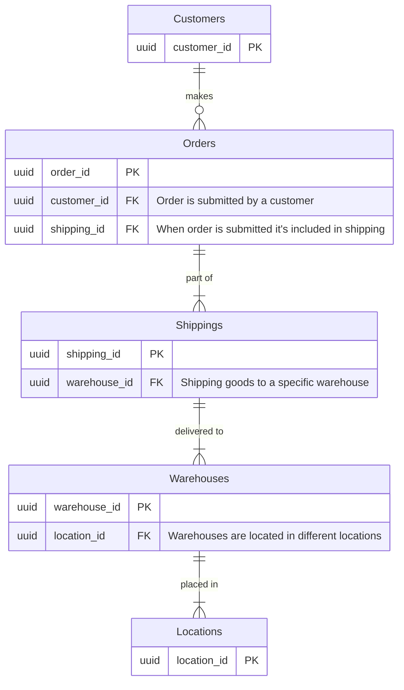

```mermaid
erDiagram

Customers {
    uuid customer_id PK
}

Orders {
    uuid order_id PK
    uuid customer_id FK "Order is submitted by a customer"
    uuid shipping_id FK "When order is submitted it's included in shipping"
}

Shippings {
    uuid shipping_id PK
    uuid warehouse_id FK "Shipping goods to a specific warehouse"
}

Warehouses {
    uuid warehouse_id PK
    uuid location_id FK "Warehouses are located in different locations"
}

Locations {
    uuid location_id PK
}

Customers ||--o{ Orders : "makes"
Orders ||--|{ Shippings : "part of"
Shippings ||--|{ Warehouses : "delivered to"
Warehouses ||--|{ Locations : "placed in"
```
